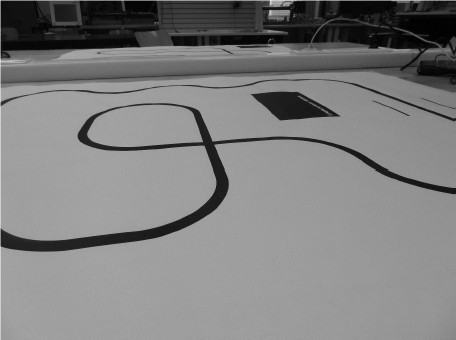

# LineFollower

lege repository die je als template kan gebruiken om een eigen repository te starten voor uw linefollower project

  
## specifications

microcontroller: ATmega328 (Arduino Nano) 

motors: Gear motor 9V - 10:1 

h-bridge: Adafruit TB6612 

sensors: QTR-8A

batteries: Lipo 3S 11,1V 

wireless communication: HC-05

distance sensor - motors: 120mm

weight: 271g

speed: 0,970 m/s

